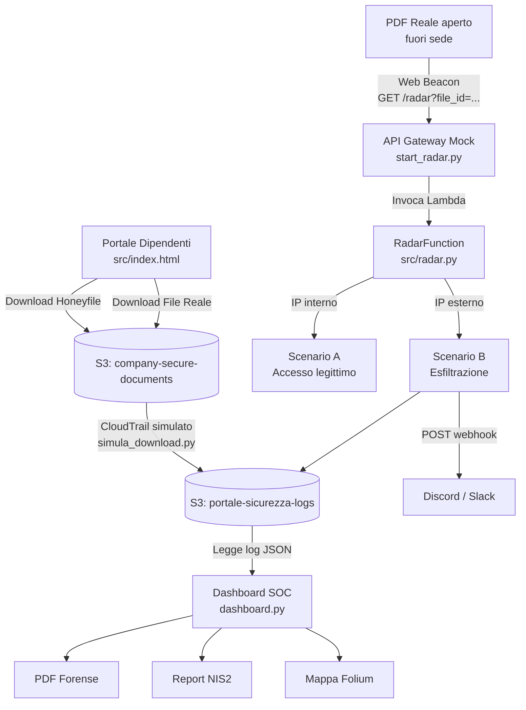

# Cloud Active Defense — Honeyfiles & Digital Watermarking

Architettura Cloud-Native di **Active Defense** per contrastare *Data Exfiltration* e *Insider Threat*.  
Combina **Deception Technology** (Honeyfile) e **Active Digital Watermarking** (Web Beacon) per rilevare in tempo reale il furto di documenti aziendali e mappare geograficamente l'attaccante.

---

## Architettura del sistema



### Scenari di rilevamento

| Scenario | Trigger | Risposta |
|----------|---------|---------|
| **A — Honeyfile** | Download del file esca | Log CloudTrail simulato → allarme dashboard |
| **B — File Reale** | Apertura PDF fuori perimetro IP | Log esfiltrazione S3 + webhook Discord/Slack |

---

## Stack tecnologico

| Layer | Tecnologie |
|-------|-----------|
| Infrastruttura | Docker, LocalStack (AWS locale) |
| Servizi AWS simulati | S3, IAM, Lambda, API Gateway, SNS |
| Backend | Python 3.9+, boto3 |
| Generazione documenti | reportlab, geoip2 |
| Dashboard | Streamlit, Folium, Plotly |
| Test | pytest |

---

## Prerequisiti

- **Docker Desktop** in esecuzione
- **Python 3.9+**
- *(Opzionale)* Database GeoIP MaxMind GeoLite2-City (vedi sotto)
- *(Opzionale)* Webhook Discord o Slack per notifiche live

### Database GeoIP — MaxMind GeoLite2

Il file `.mmdb` (~70 MB) è escluso da git. Per scaricarlo:

1. Crea un account gratuito su [maxmind.com/en/geolite2/signup](https://www.maxmind.com/en/geolite2/signup)
2. Vai su *Download Files* → **GeoLite2 City** → scarica il `.tar.gz`
3. Estrai `GeoLite2-City.mmdb` e copialo in `data/geoip/GeoLite2-City.mmdb`

Senza il database, la geolocalizzazione restituisce `(0.0, 0.0)` con avviso a console.

### Webhook Discord / Slack *(opzionale)*

1. Discord: *Impostazioni canale → Integrazioni → Crea Webhook* → copia URL
2. Incolla l'URL in `config.yaml` sotto `alerts.webhook_url`

---

## Setup e avvio rapido

### Windows (PowerShell)

```powershell
pip install -r requirements.txt
.\setup.ps1
streamlit run dashboard.py
```

### Linux / macOS

```bash
pip install -r requirements.txt
chmod +x setup.sh && ./setup.sh
streamlit run dashboard.py
```

### Comandi manuali (step-by-step)

```bash
# 1. Avvia LocalStack
docker-compose up -d

# 2. Attendi che LocalStack sia pronto (endpoint health: http://localhost:4566/_localstack/health)

# 3. Crea bucket S3 e configura auditing
python setup_auditing.py

# 4. Crea topic SNS
python setup_sns.py

# 5. Genera Honeyfile e File Reale, carica su S3
python src/generator.py

# 6. Avvia il Radar (API Gateway + Lambda)
python start_radar.py
```

Apri `src/index.html` nel browser per accedere al portale esca.  
Apri `streamlit run dashboard.py` per la dashboard SOC.

---

## Struttura del progetto

```
cloud-active-defense/
├── config.yaml               # Configurazione centralizzata
├── config.py                 # Loader config.yaml
├── dashboard.py              # Entry point Streamlit
├── dashboard/
│   ├── tabs/                 # Tab HONEYFILE / ESFILTRAZIONE / REPORT
│   └── utils/                # Caricamento dati S3, generazione PDF
├── src/
│   ├── generator.py          # Genera PDF Honeyfile e File Reale
│   ├── radar.py              # Lambda: detection beacon + webhook
│   ├── index.html            # Portale dipendenti (esca)
│   └── requirements.txt
├── start_radar.py            # Mock API Gateway + deploy Lambda
├── setup_auditing.py         # Crea bucket S3 e policy
├── setup_sns.py              # Crea topic SNS
├── simula_download.py        # Simula download e traffico esterno
├── infra/
│   └── init-scripts/         # Script IAM eseguiti da LocalStack all'avvio
├── data/
│   ├── geoip/                # GeoLite2-City.mmdb (non in git)
│   ├── hr_data.json          # Database HR dipendenti
│   └── policies/             # JSON policy IAM
└── tests/                    # Unit test pytest
```

---

## Eseguire i test

```bash
python -m pytest tests/ -v
```

---

## Limiti della simulazione (LocalStack Community)

| Funzionalità | Stato |
|-------------|-------|
| CloudTrail nativo | Non disponibile → sostituito con logger custom JSON su S3 |
| SNS invio email reale | Non disponibile → sostituito con webhook HTTP |
| IAM enforcement completo | Parziale → ruoli e policy creati ma non applicati da LocalStack Community |
| Latenze e costi reali AWS | Non simulati |
