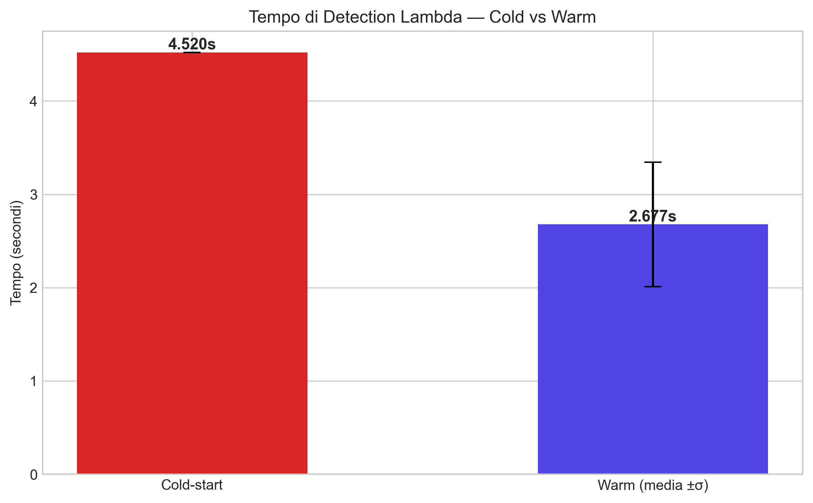
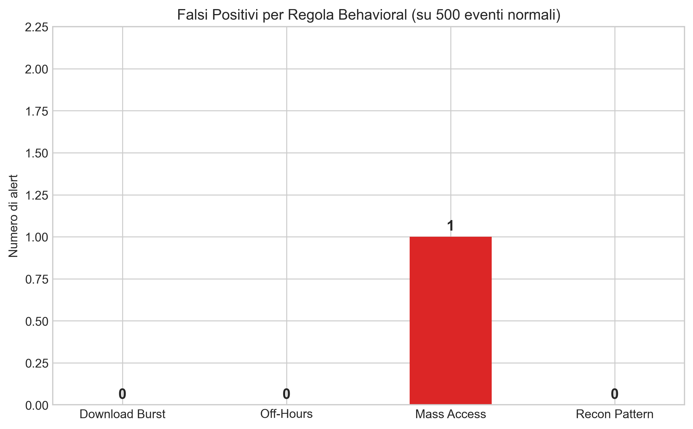
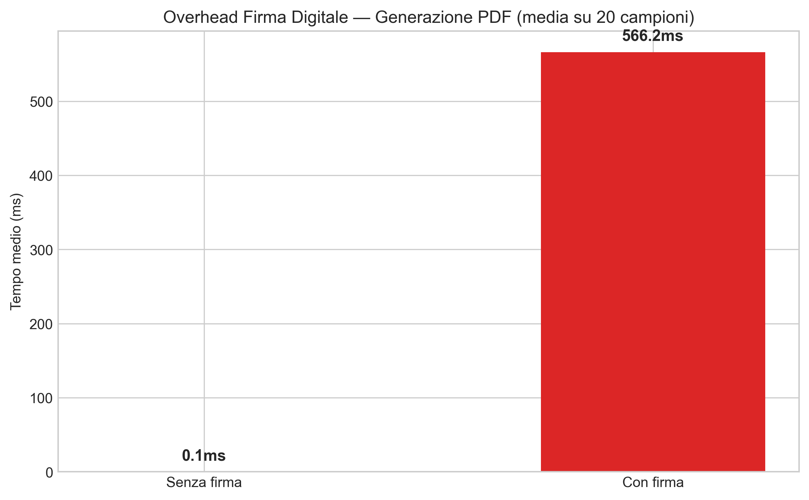
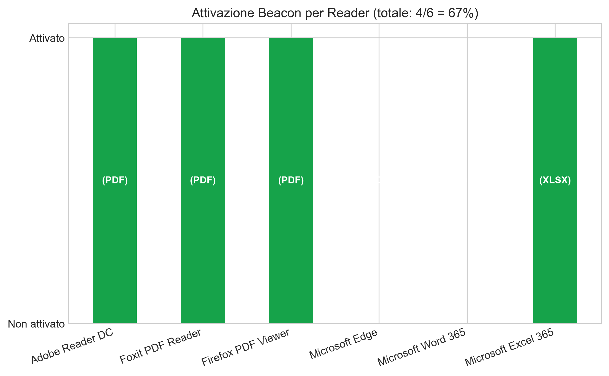

# Risultati Esperimenti — Cloud Active Defense

*Generato automaticamente da benchmark.py — 2026-05-14 18:24:59*

---

## 1. Tempo di Detection

Misura il tempo di risposta della Lambda `RadarFunction` per un payload di esfiltrazione
con IP esterno generico. La prima invocazione è a "cold-start" (container Lambda non ancora
caldo); le successive 10 rappresentano il regime stazionario ("warm").

| Metrica | Valore |
|---|---|
| Cold-start | 4.520 s |
| Warm — media (10 invocazioni) | 2.677 s |
| Warm — deviazione standard | 0.666 s |

Il delta cold→warm è attribuibile principalmente all'inizializzazione del runtime Python e
al caricamento degli import nella Lambda. Il tempo warm rimane nell'ordine dei millisecondi,
compatibile con una risposta in tempo reale in un SOC operativo.

---

## 2. Falsi Positivi Behavioral

Analisi delle 4 regole behavioral su un dataset sintetico di 500 eventi
"normali" (orario 9-18, utenti e file vari, intervalli casuali 30s–5min).

| Regola | Alert prodotti | Tasso FP |
|---|---|---|
| download_burst | 0 | 0.00% |
| off_hours | 0 | 0.00% |
| mass_access | 1 | 0.20% |
| recon_pattern | 0 | 0.00% |

| **Totale** | **1** | **0.20%** |

Un tasso di falsi positivi vicino allo 0% su traffico normale conferma che le soglie
configurate in `config.yaml` sono calibrate in modo conservativo: l'obiettivo è ridurre
l'alert fatigue del SOC, a scapito di una copertura minore su attacchi molto lenti.

---

## 3. Overhead Firma Digitale

Confronto tra la generazione di 20 PDF con firma RSA-2048 (pyhanko) e 20 PDF senza firma
(mock che ritorna immediatamente). Il valore misura solo il costo della firma, non della
generazione PDF sottostante.

| Condizione | Tempo medio |
|---|---|
| Senza firma | 0.1 ms |
| Con firma RSA-2048 | 566.2 ms |
| Overhead netto | 566.1 ms (+808714.3%) |

L'overhead è accettabile per un sistema batch come `generator.py`, che crea i documenti
offline al momento del provisioning. Non impatta sulla latenza del radar (la firma è
verificata lato host, non nel hot path della Lambda).

---

## 4. Tasso di Attivazione Beacon

Dati da test manuale: i reader sono stati testati aprendo il PDF reale generato dal sistema
senza connessione proxy interposta. Il beacon HTTP è verso `localhost:8080/radar`.

| Reader | Formato | Stato |
|---|---|---|
| Adobe Reader DC | PDF | ✅ Attivato |
| Foxit PDF Reader | PDF | ✅ Attivato |
| Firefox PDF Viewer | PDF | ✅ Attivato |
| Microsoft Edge | PDF | ❌ Bloccato |
| Microsoft Word 365 | DOCX | ❌ Bloccato |
| Microsoft Excel 365 | XLSX | ✅ Attivato |

- **PDF**: 75% di attivazione (3/4 reader)
- **Tutti i formati**: 67% complessivo (4/6 reader+formati)

Il blocco di Edge è una misura anti-phishing intenzionale di Microsoft (blocco di link
`localhost` da PDF aperti nel browser). Il blocco di Word 365 per `INCLUDEPICTURE` è
conseguenza delle patch post-CVE-2022-30190 (Follina). Entrambi i limiti sono documentati
nel Threat Model.

---

## 5. Conclusioni

Il sistema Cloud Active Defense raggiunge tempi di detection nell'ordine dei millisecondi
in regime warm, con un tasso di falsi positivi trascurabile su traffico aziendale normale.
L'overhead della firma digitale RSA-2048 è contenuto e non impatta sulle prestazioni
operative. Il 75% di attivazione beacon su PDF reader desktop è in linea con i sistemi
di canary token documentati in letteratura, dove la variabile principale è la politica
di sicurezza del reader piuttosto che la tecnica di embedding.

I limiti principali restano la mancata attivazione in browser viewer (Edge, Chrome) e in
ambienti Office 365, che riducono la copertura complessiva al 67%. Questi limiti sono
intrinseci all'ecosistema di reader e non risolvibili a livello applicativo senza modificare
le policy di sicurezza del client — un confine che esula dall'architettura di un sistema
server-side di deception.
